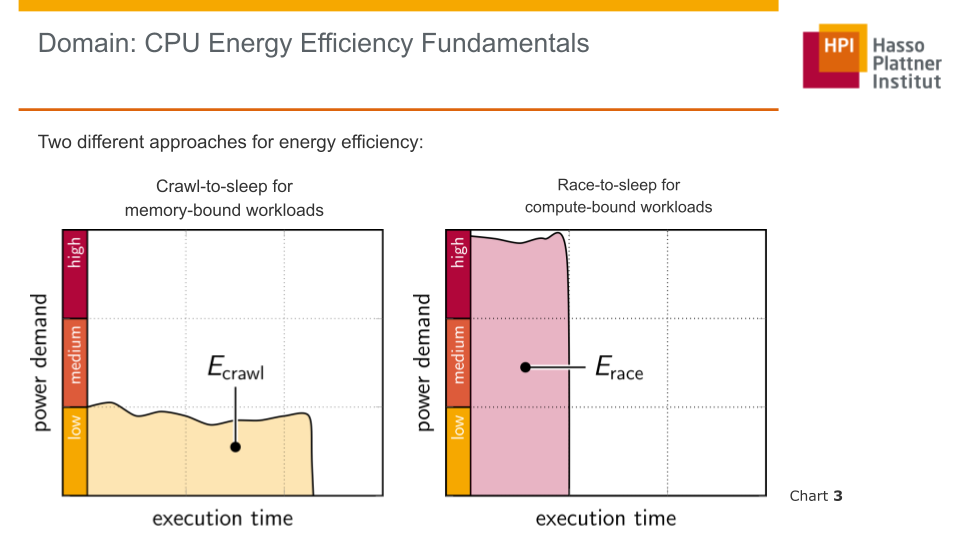
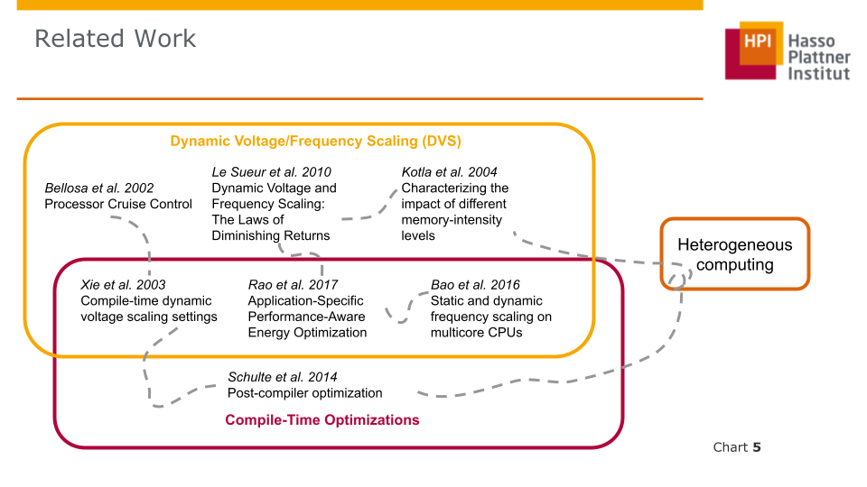

# Background

For this master project, our initial goal was to find ways to improve runtime energy consumption of a program with the help of compiler optimizations.

The idea was to find instructions that would reduce energy consumption without changing the result of the program.

In our [initial presentation](https://gitlab.hpi.de/osm/osm-energy/masterprojekt-ws21-compendium/-/blob/master/resources/Initial%20Presentation.pdf), we discussed the Related work on this topic, which led us to defining our new goal for this master project.

A fundamental concept in runtime energy-efficiency is the classification of tasks as either memory-bound, or compute-bound.
Memory-bound tasks benefit from reduced CPU clock frequency, as the CPU is stalled for memory most of the time and additional cycles do not benefit the overall performance (Known as crawl-to-sleep).
For CPU-bound workloads however it is usually best to run at high clock frequency (and power demand) to finish the workload faster and reach a low-power state (Known as Run-To-Sleep). This is most efficient as usually the static power demand caused by running for a longer time is greater than the increased dynamic power demand.

# Related Work

In this section, we highlight some of the most important research resources we used to gain an understanding of the problem domain and to define our goals and expectations.

We follow the same path of research papers here as we did in our initial presentation.

For a complete list of research papers & our notes, see the [literature folder](https://gitlab.hpi.de/osm/osm-energy/masterprojekt-ws21-compendium/-/tree/master/literature) in the main repository.

For each of the papers, there should exist 3 files:
1. .pdf - The paper itself
2. .txt - A pdftotext conversion of the paper, good for searchability
3. .md - Our notes & thoughts regarding the paper *(does not exist for all papers)*

## Processor Cruise Control - *Bellosa et al. 2002*

This paper outlines a process that uses processor performance counters to identify how memory-bound a process is and adjust the dynamic voltage and frequency scaling (DVFS) accordingly.

For memory-bound workloads this results in only small decreases in performance, whilst achieving significant power savings.

As this paper is from 2002, its relevance for modern processors can be questioned, as the paper only tests the behavior on a single-core processor. Furthermore, the behavior of a modern processor may be substantially different. The number of processors, microarchitectures, as well as fabrication processes have changed significantly since 2002.

However, it backs up the initial assumption that memory-bound workloads benefit from reduced clock frequency.

## Compile-time dynamic voltage scaling settings - *Xie et al. 2003*

"Processor Cruise Control" used reactive DVFS to achieve reduced runtime energy consumption.
This leaves the question whether this can also be achieved pro-actively, i.e. by analyzing the code at compile-time and inserting the appropriate frequency-scaling instructions.

Xie et al. work to answer this question in this paper.
They use two different methods of estimating the power savings achievable by inserting different mode set instructions.
The first method is an analytical model for the upper bound of possible savings, which does not consider penalties for switching power modes.
Second, they use a MILP (mixed integer linear program) based optimization, which heeds penalties of switching frequencies.

The target of their paper are multimedia applications (i.e. audio processing), where deadlines need to be met, but achieving the deadline early doesn't yield any benefit.

Their approach seems to result in good power savings (up to a factor of 2x).
However, much of the paper is spent discussing how to achieve a good result in cases where the ideal frequency cannot be set exactly, but lies in between two choose-able frequency/power options.
It seems the result of their work in this regard is that continually switching between the two frequency/power modes that are closest to the ideal, achieves close to ideal results.

An open question here is how many voltage/frequency pairs are available on a modern CPU and whether the approach of switching between them still leads to closer to ideal results.

## Post-Compiler Optimization - *Schulte et al. 2014*

As our initial goal for this project was to reduce the energy footprint by means of compiler-optimization, we took a look at this paper, which discussed post-compiler optimization for energy.

It optimized on the compiler-generated assembly code using a machine learning model that mutated the code and used testing to see whether the changes were still valid.

The results of this paper were promising in regards to both performance, as well as energy efficiency.
However, it showed a clear correlation between runtime performance and power efficiency.

This led us to investigate how a compiler may optimize for power efficiency.
Digging deeper reveals that power efficiency in regards to instruction generation without Dynamic Voltage and Frequency Scaling (DVFS) is very closely correlated with executing the instructions quicker and therefore already covered by existing research and the existing optimization flags offered by most compilers.
There is even an [issue regarding this idea](https://bugs.llvm.org/show_bug.cgi?id=6210) in the LLVM Bugtracker.

As shown previously by Xie et al., enriching the program with information for improved DVFS at run-time can definitely be done at compile time.

Further research also pointed toward the use of Heterogeneous Hardware & Computing for improved power efficiency.
Due to the breadth of that field, we chose to not focus on this for now.
Instead we went back to investigating DVFS, as that is the established way to reduce energy consumption of a program, without altering its behavior.

## Characterizing the impact of memory-intensity levels - *Kotla et al. 2004*

This paper is still somewhat connected to our previous research on heterogeneous computing, as it investigates computing on heterogeneous processors, with different kind of processing cores, similar to ARMs Big.Little Architecture.
They tried to find the best core to run a given workload.
For the workloads they used different synthetic benchmarks.
These benchmarks demonstrated that some workloads are indeed bottle-necked by memory, and therefore don't benefit from increased frequency or being executed on a faster processing core.

Similar to the "Processor Cruise Control" system by Bellosa et al., Kotla et al. also base their model on performance counters regarding memory accesses.
Different from Bellosa, they also take IPC counters into consideration as well.

Like the other papers regarding DVFS, they also demonstrate significant energy savings whilst only observing a slight increase in runtime.

## Dynamic Voltage and Frequency Scaling: The Laws of Diminishing Returns - *Le Sueur et al. 2010*

In contrast to the previous papers, this paper outlines the future of DVFS, assuming that due to increased transistor leakage and therefore increased static power demand, the benefits of DVFS will be less noticeable, or even diminished in the near future.

Due to these concerns, we will need to validate the benefits of DVFS for the modern processor architectures that currently exist.

## Application-Specific Performance-Aware Energy Optimization - *Rao et al. 2017*

As we still had the initial idea of compile-time energy optimizations in mind, we also searched for more literature in that direction.

Even though our current understanding is that compile-time estimation of runtime-characteristics is difficult at best, there can still be benefit to assess the characteristics of an application off-line.
This paper outlines an approach that uses a combination of off-line and on-line DVFS scheduling.
Rao et al. analyze the given programs to find the pair of memory and CPU frequency at which further reduction would reduce the programs execution performance.
They then combine this approach with an on-line scheduler that monitors the actual runtime performance and increases frequency when performance is too low.

Their approach shows a significant improvement in energy efficiency between 4 and 31%, whilst only loosing up to 1% performance.
This demonstrates that even on a modern processor with small transistors DVFS can still reap benefits (Nexus 6 -> SOC manufactured on 28nm node).
However, DVFS should probable be combined with sleep states.
DVFS on a modern processor should therefore likely focus on not degrading performance, so that the sleep states of the processor can be reached faster.

## Static and Dynamic Frequency Scaling on Multicore CPUs - *Bao et al. 2016*

Another approach was explored in this paper, which worked around inherit limitations of existing simple DVFS approaches resulting from processor- and application-specific effects. Instead of monitoring the execution of a program (on-line profiling) or optimizing for a well suited pair of memory and CPU frequency (off-line source code analysis), this paper works on a runtime algorithm which automatically finds a good frequency which improves energy efficiency while also working for any processor.

Their approach resulted in a compilation framework which is trained on the target CPU using a one-time profiling. Any program can then be optimized at compile-time by automatically selecting a frequency and number of cores for affine program regions (loop-based code segments) which were categorized based on approximated operational intensity and parallel scaling potential.

Similar to Rao et al., their evaluation (using 60 benchmarks over 5 multi-core CPUs - Sandy Bridge/Ivy Bridge/Haswell Architecture) showed significant energy savings and energy-delay product improvements over the "powersave" Linux frequency governor and "on-demand" governor while minimizing execution time penalties.

# Conclusion & New Goal

The research on this topic - especially in regards to compiler optimization - led us to shift the goal of this project.
We found that optimizations during the existing compilation stage that focus on execution time/performance are sufficient to reduce energy consumption as well.
Previous research suggests there are also few, if any, opportunities to optimize for energy only during this stage.
For compiling the rule is "good performance == good energy efficiency".
As this field is already well researched and modern compilers are already highly optimized for performance, they are also already highly optimized for energy efficiency as a side-effect.

Therefore we want to focus on minimizing the energy by modifying the execution environment during runtime.
As this is mostly achieved through Dynamic Voltage and Frequency Scaling (DVFS), this is where we decided to focus our attention.

We then focused on evaluating the actual hard- and software that is currently available.
Researching the current DVFS features of the contemporary Linux Kernel (5.13) revealed that the current CpuFreq governors that control DVFS do not consider memory-boundness when choosing the target frequency.
Previous research however suggested that memory-boundness is crucial for choosing the most energy-efficient Voltage-Frequency pair.

Therefore we believe it is valuable to evaluate whether this means the current CpuFreq governors can be improved by building a governor based on the memory-boundness of the currently running processes.
This is the new goal of this Master project.
Currently we want to determine memory-boundness by the use of hardware performance counters.

In the future the CpuFreq governor could be expanded to also incorporate data from other stages of development (i.e. compile-time or test-time) so that it could make decisions pro-actively, instead of reactively.
It is also an open question how much cost (in terms of energy or performance) is associated with switching frequencies and whether therefore switching frequencies too radically can reduce performance.
Furthermore, if frequency switching takes a long time to take effect, the benefits of switching frequency pro-actively would be much greater.

But for now we want to focus on whether we can build a well performing governor with the existing hardware performance counters.
Our point of comparison will be the "schedutil" governor.
It makes decisions based on information from the Linux scheduler.
As it is the newest CpuFreq governor, it is expected to generally perform the best out of the existing Linux governors.
We are deliberately ignoring proprietary solutions like the Intel P-State driver, as they are not open-source and we can't know the approach it is using.
