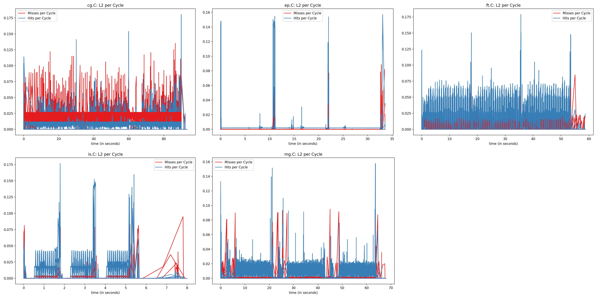

For the evaluation of the measurements, see the "Evaluation" section at the [bottom of this page](#evaluation)

# Measured Counters:

| Title | Counter 1 | Counter 2 | Counter 3 | plot_op | plot names |
| ----- | --------- | ----------| --------- | ------- | ---------- |
| L2_Fill_Pending | l2_fill_pending.l2_fill_busy | l2_latency.l2_cycles_waiting_on_fills | cycles | div_1_3+div_2_3 | Pending, Latency |
| L2_Fill_Pending | l2_fill_pending.l2_fill_busy | l2_latency.l2_cycles_waiting_on_fills | cycles | div_1_3 | Pending |
| Load Store Inst | ls_dispatch.ld_dispatch | ls_dispatch.ld_st_dispatch | instructions | div_1_3+div_2_3 | Load, Load-Store |
| L2_Hitrate | l2_cache_req_stat.ic_dc_miss_in_l2 | l2_cache_req_stat.ic_dc_hit_in_l2 | cycles | div_1_(1+2) | Hitrate |
| Backend-Frontend-Stalls | stalled-cycles-backend | stalled-cycles-frontend | cycles | div_1_3+div_2_3 | Backend, Frontend |
| IPC | instructions | cycles | cycles | div_1_2 | IPC |
| L3 per Cycle | l3_cache_accesses | l3_misses | cycles | div_1_3+div_2_3 | Accesses per Cycle, Misses per Cycle |
| L2 per Cycle | l2_cache_req_stat.ic_dc_miss_in_l2 | l2_cache_req_stat.ic_dc_hit_in_l2 | cycles | div_1_3+div_2_3 | Misses per Cycle, Hits per Cycle |
| L2 PF Miss per Cycle | l2_pf_miss_l2_hit_l3 | l2_pf_miss_l2_l3 | cycles | div_1_3+div_2_3 | L2 PF Miss, L3 Hit per Cycle, L2 PF Miss, L3 Miss per Cycle |

```python
counters = [{'counter': ['l2_fill_pending.l2_fill_busy', 'l2_latency.l2_cycles_waiting_on_fills', 'cycles'], 'title': 'L2_Fill_Pending', 'plot_op': 'div_1_3+div_2_3', 'plot_names': ['Pending', 'Latency']},
            {'counter': ['l2_fill_pending.l2_fill_busy', 'l2_latency.l2_cycles_waiting_on_fills', 'cycles'], 'title': 'L2_Fill_Pending', 'plot_op': 'div_1_3', 'plot_names': ['Pending']},
            {'counter': ['ls_dispatch.ld_dispatch', 'ls_dispatch.ld_st_dispatch', 'instructions'], 'title': 'Load Store Inst', 'plot_op': 'div_1_3+div_2_3', 'plot_names': ['Load', 'Load-Store']},
            {'counter': ['l2_cache_req_stat.ic_dc_miss_in_l2', 'l2_cache_req_stat.ic_dc_hit_in_l2', 'cycles'], 'title': 'L2_Hitrate', 'plot_op': 'div_1_(1+2)', 'plot_names': ['Hitrate']},
            {'counter': ['stalled-cycles-backend', 'stalled-cycles-frontend', 'cycles'], 'title': 'Backend-Frontend-Stalls', 'plot_op': 'div_1_3+div_2_3', 'plot_names': ['Backend', 'Frontend']},
            {'counter': ['instructions', 'cycles', 'cycles'], 'title': 'IPC', 'plot_op': 'div_1_2', 'plot_names': ['IPC']},
            {'counter': ['l3_cache_accesses', 'l3_misses', 'cycles'], 'title': 'L3 per Cycle', 'plot_op': 'div_1_3+div_2_3', 'plot_names': ['Accesses per Cycle', 'Misses per Cycle']},
            {'counter': ['l2_cache_req_stat.ic_dc_miss_in_l2', 'l2_cache_req_stat.ic_dc_hit_in_l2', 'cycles'], 'title': 'L2 per Cycle', 'plot_op': 'div_1_3+div_2_3', 'plot_names': ['Misses per Cycle', 'Hits per Cycle']},
            {'counter': ['l2_pf_miss_l2_hit_l3', 'l2_pf_miss_l2_l3', 'cycles'], 'title': 'L2 PF Miss per Cycle', 'plot_op': 'div_1_3+div_2_3', 'plot_names': ['L2 PF Miss, L3 Hit per Cycle', 'L2 PF Miss, L3 Miss per Cycle']}]

```

# All Cores





# Evaluation

ToDo