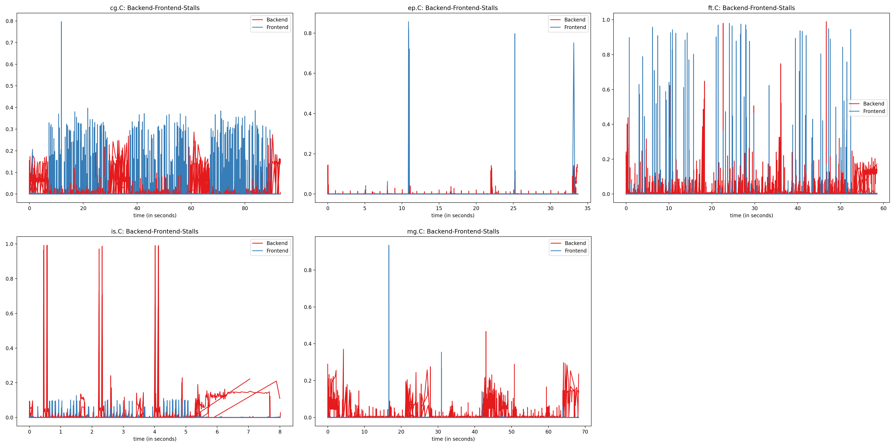
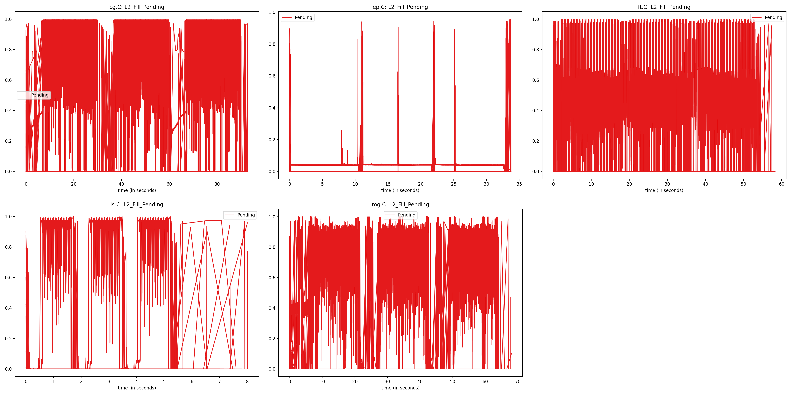
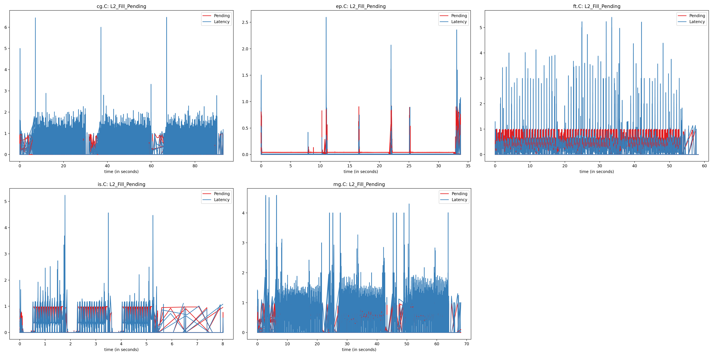
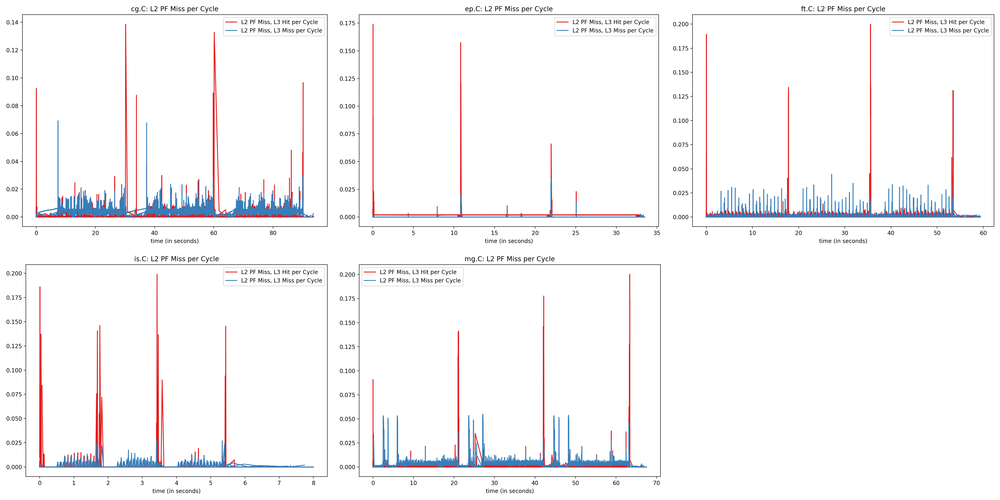

For the evaluation of the measurements, see the "Evaluation" section at the [bottom of this page](#evaluation)

# Measured Counters:

| Title | Counter 1 | Counter 2 | Counter 3 | plot_op | plot names |
| ----- | --------- | ----------| --------- | ------- | ---------- |
| L2_Fill_Pending | l2_fill_pending.l2_fill_busy | l2_latency.l2_cycles_waiting_on_fills | cycles | div_1_3+div_2_3 | Pending, Latency |
| L2_Fill_Pending | l2_fill_pending.l2_fill_busy | l2_latency.l2_cycles_waiting_on_fills | cycles | div_1_3 | Pending |
| Load Store Inst | ls_dispatch.ld_dispatch | ls_dispatch.ld_st_dispatch | instructions | div_1_3+div_2_3 | Load, Load-Store |
| L2_Hitrate | l2_cache_req_stat.ic_dc_miss_in_l2 | l2_cache_req_stat.ic_dc_hit_in_l2 | cycles | div_1_(1+2) | Hitrate |
| Backend-Frontend-Stalls | stalled-cycles-backend | stalled-cycles-frontend | cycles | div_1_3+div_2_3 | Backend, Frontend |
| IPC | instructions | cycles | cycles | div_1_2 | IPC |
| L3 per Cycle | l3_cache_accesses | l3_misses | cycles | div_1_3+div_2_3 | Accesses per Cycle, Misses per Cycle |
| L2 per Cycle | l2_cache_req_stat.ic_dc_miss_in_l2 | l2_cache_req_stat.ic_dc_hit_in_l2 | cycles | div_1_3+div_2_3 | Misses per Cycle, Hits per Cycle |
| L2 PF Miss per Cycle | l2_pf_miss_l2_hit_l3 | l2_pf_miss_l2_l3 | cycles | div_1_3+div_2_3 | L2 PF Miss, L3 Hit per Cycle, L2 PF Miss, L3 Miss per Cycle |

```python
counters = [{'counter': ['l2_fill_pending.l2_fill_busy', 'l2_latency.l2_cycles_waiting_on_fills', 'cycles'], 'title': 'L2_Fill_Pending', 'plot_op': 'div_1_3+div_2_3', 'plot_names': ['Pending', 'Latency']},
            {'counter': ['l2_fill_pending.l2_fill_busy', 'l2_latency.l2_cycles_waiting_on_fills', 'cycles'], 'title': 'L2_Fill_Pending', 'plot_op': 'div_1_3', 'plot_names': ['Pending']},
            {'counter': ['ls_dispatch.ld_dispatch', 'ls_dispatch.ld_st_dispatch', 'instructions'], 'title': 'Load Store Inst', 'plot_op': 'div_1_3+div_2_3', 'plot_names': ['Load', 'Load-Store']},
            {'counter': ['l2_cache_req_stat.ic_dc_miss_in_l2', 'l2_cache_req_stat.ic_dc_hit_in_l2', 'cycles'], 'title': 'L2_Hitrate', 'plot_op': 'div_1_(1+2)', 'plot_names': ['Hitrate']},
            {'counter': ['stalled-cycles-backend', 'stalled-cycles-frontend', 'cycles'], 'title': 'Backend-Frontend-Stalls', 'plot_op': 'div_1_3+div_2_3', 'plot_names': ['Backend', 'Frontend']},
            {'counter': ['instructions', 'cycles', 'cycles'], 'title': 'IPC', 'plot_op': 'div_1_2', 'plot_names': ['IPC']},
            {'counter': ['l3_cache_accesses', 'l3_misses', 'cycles'], 'title': 'L3 per Cycle', 'plot_op': 'div_1_3+div_2_3', 'plot_names': ['Accesses per Cycle', 'Misses per Cycle']},
            {'counter': ['l2_cache_req_stat.ic_dc_miss_in_l2', 'l2_cache_req_stat.ic_dc_hit_in_l2', 'cycles'], 'title': 'L2 per Cycle', 'plot_op': 'div_1_3+div_2_3', 'plot_names': ['Misses per Cycle', 'Hits per Cycle']},
            {'counter': ['l2_pf_miss_l2_hit_l3', 'l2_pf_miss_l2_l3', 'cycles'], 'title': 'L2 PF Miss per Cycle', 'plot_op': 'div_1_3+div_2_3', 'plot_names': ['L2 PF Miss, L3 Hit per Cycle', 'L2 PF Miss, L3 Miss per Cycle']}]

```

# All Cores











# Evaluation

We first worked on [finding counters](Counters-Intel) and creating a good heuristic for Intel processors. Because the counters used for Intel are not available on AMD processors we had to again do this step of identifying suitable counters on AMD processors that reliably indicate which tasks benefit from reducing the cores clock frequency. 

Refresher: We have thus far been able to categorize the different workloads depending on how much they benefit from a reduced clock frequency:

1. mg.C - mostly heavily memory-bound, except during a short startup-phase
1. cg.B - mostly memory-bound, but less so than mg.C
1. ft.B - in-between, benefiting a lot in runtime performance with increased clock frequency - up to a point.
1. ep.B - cpu-bound workload - highest frequency here is best
1. is.C - memory-bound workload, however this workload does *not* benefit much from a reduced frequency!

At the start we hoped that the `l2_fill_pending.l2_fill_busy` counter could be used in a similar way as the identified Intel counter to measure how much the processor stalls on waits on the offcore domain. However is.C has a high counter value although it benefits from an increased frequency. Looking at the other counters the L3 accesses per cycle seem to correctly identify the workloads. Yet the counter value itself seems to be inverse to our intuition: The workloads benefiting from higher frequencies have high accesses per cycle while the workloads benefiting from low frequencies have to accesses per cycle. We expected memory bound workloads to have a lot of memory accesses and therefore a high access per cycle counter value, while a compute bound workload should not need to access memory and therefore should have a low counter value. One explanation could be that one L3 access that does not stall will run for many cycles under a compute bound workload that uses a high frequency so its counted often (for every cycle). So having just a few load instructions that don't stall and get counted as access across many cycles might cause a high counter value. Inversely when one access stalls for a memory bound workload just this access is counted until it is available and no other load instruction can cause accesses that are run in parallel and are also counted. Still we are very unsure about our understanding of this counter so we discarded the idea of using it and instead looked for other possibilities.

The counter we identified as suitable is the instructions per cycle (IPC) counter, as it correctly classifies the different workloads. It has a smaller difference between compute-bound and memory-bound workloads (~0.6 for ep.B vs ~0.2 for mg.C) but it is good enough to build a heuristic based on it. For more information about the heuristic we built with this counter see the [heuristics page](Memutil-heuristics).