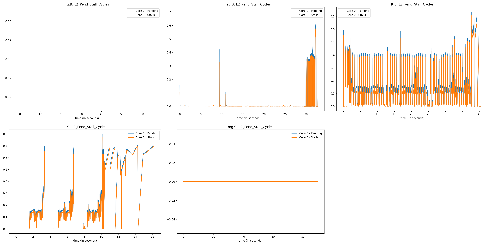

# Measured Counters:

| Title | Counter 1 | Counter 2 | Counter 3 | plot_op |
| ----- | --------- | ----------| --------- | ------- |
| L1_Pend_Stall_Cycles | cycle_activity.cycles_l1d_miss | cycle_activity.stalls_l1d_miss | cpu_clk_unhalted.thread | div_1_3+div_2_3 |
| L2_Pend_Stall_Cycles | cycle_activity.cycles_l2_miss | cycle_activity.stalls_l2_miss | cpu_clk_unhalted.thread | div_1_3+div_2_3 |
| L3_Pend_Stall_Cycles | cycle_activity.cycles_l3_miss | cycle_activity.stalls_l3_miss | cpu_clk_unhalted.thread | div_1_3+div_2_3 |
| L1_Hitrate | mem_load_retired.l1_hit | mem_load_retired.l1_miss | cpu_clk_unhalted.thread | div_1_(1+2) |
| L2_Hitrate | mem_load_retired.l2_hit | mem_load_retired.l2_miss | cpu_clk_unhalted.thread | div_1_(1+2) |
| L3_Hitrate | mem_load_retired.l3_hit | mem_load_retired.l3_miss | cpu_clk_unhalted.thread | div_1_(1+2) |
| U_Execute-Stall_vs_Mem-Stall | uops_executed.stall_cycles | cycle_activity.stalls_mem_any | cpu_clk_unhalted.thread | div_1_3+div_2_3 |
| U_Retired-Stall_vs_Mem-Stall | uops_retired.stall_cycles | cycle_activity.stalls_mem_any | cpu_clk_unhalted.thread | div_1_3+div_2_3 |
| U_Issued-Stall_vs_Mem-Stall | uops_issued.stall_cycles | cycle_activity.stalls_mem_any | cpu_clk_unhalted.thread | div_1_3+div_2_3 |
| U_Resource-Stall_vs_Mem-Stall | resource_stalls.any | cycle_activity.stalls_mem_any | cpu_clk_unhalted.thread | div_1_3+div_2_3 |
| Stall_Total_vs_Mem-Stall | cycle_activity.stalls_total | cycle_activity.stalls_mem_any | cpu_clk_unhalted.thread | div_1_3+div_2_3 |
| Divider cycles vs IPC | arith.divider_active | inst_retired.any | cpu_clk_unhalted.thread | div_1_3+div_2_3 |


```python
counters = [{'counter': ['cycle_activity.cycles_l1d_miss', 'cycle_activity.stalls_l1d_miss', 'cpu_clk_unhalted.thread'], 'title': 'L1_Pend_Stall_Cycles', 'plot_op': 'div_1_3+div_2_3', 'plot_names': ['Pending', 'Stalls']},
            {'counter': ['cycle_activity.cycles_l2_miss', 'cycle_activity.stalls_l2_miss', 'cpu_clk_unhalted.thread'], 'title': 'L2_Pend_Stall_Cycles', 'plot_op': 'div_1_3+div_2_3', 'plot_names': ['Pending', 'Stalls']},
            {'counter': ['cycle_activity.cycles_l3_miss', 'cycle_activity.stalls_l3_miss', 'cpu_clk_unhalted.thread'], 'title': 'L3_Pend_Stall_Cycles', 'plot_op': 'div_1_3+div_2_3', 'plot_names': ['Pending', 'Stalls']},
            {'counter': ['mem_load_retired.l1_hit', 'mem_load_retired.l1_miss', 'cpu_clk_unhalted.thread'], 'title': 'L1_Hitrate', 'plot_op': 'div_1_(1+2)', 'plot_names': ['Hitrate']},
            {'counter': ['mem_load_retired.l2_hit', 'mem_load_retired.l2_miss', 'cpu_clk_unhalted.thread'], 'title': 'L2_Hitrate', 'plot_op': 'div_1_(1+2)', 'plot_names': ['Hitrate']},
            {'counter': ['mem_load_retired.l3_hit', 'mem_load_retired.l3_miss', 'cpu_clk_unhalted.thread'], 'title': 'L3_Hitrate', 'plot_op': 'div_1_(1+2)', 'plot_names': ['Hitrate']},
            {'counter': ['uops_executed.stall_cycles', 'cycle_activity.stalls_mem_any', 'cpu_clk_unhalted.thread'], 'title': 'U_Execute-Stall_vs_Mem-Stall', 'plot_op': 'div_1_3+div_2_3', 'plot_names': ['Execute Stalls', 'Mem Stalls']},
            {'counter': ['uops_retired.stall_cycles', 'cycle_activity.stalls_mem_any', 'cpu_clk_unhalted.thread'], 'title': 'U_Retired-Stall_vs_Mem-Stall', 'plot_op': 'div_1_3+div_2_3', 'plot_names': ['Retired Stalls', 'Mem Stalls']},
            {'counter': ['uops_issued.stall_cycles', 'cycle_activity.stalls_mem_any', 'cpu_clk_unhalted.thread'], 'title': 'U_Issued-Stall_vs_Mem-Stall', 'plot_op': 'div_1_3+div_2_3', 'plot_names': ['Issued Stalls', 'Mem Stalls']},
            {'counter': ['resource_stalls.any', 'cycle_activity.stalls_mem_any', 'cpu_clk_unhalted.thread'], 'title': 'U_Resource-Stall_vs_Mem-Stall', 'plot_op': 'div_1_3+div_2_3', 'plot_names': ['Resource Stalls', 'Mem Stalls']},
            {'counter': ['cycle_activity.stalls_total', 'cycle_activity.stalls_mem_any', 'cpu_clk_unhalted.thread'], 'title': 'Stall_Total_vs_Mem-Stall', 'plot_op': 'div_1_3+div_2_3', 'plot_names': ['Stalls Total', 'Mem Stalls']},
            {'counter': ['arith.divider_active', 'inst_retired.any', 'cpu_clk_unhalted.thread'], 'title': 'Divider cycles vs IPC', 'plot_op': 'div_1_3+div_2_3', 'plot_names': ['Divider Cycles', 'IPC']}]
```


# Just Core 0





# All Cores


# All Cores - Less Colors


